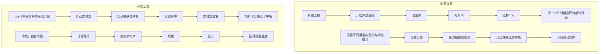

# STM32笔记

## 0.1 个人经验谈
### 1
- 如果遇到复现错误
  - 1. 把源码复制粘贴，或直接运行源码程序，硬件连接和源码完全一致，确认是否是硬件出错
  - 2. 把IO口配置分阶段替换为自己的配置，确认是否是IO口配置出错 
  - 3. 把源码分阶段替换为自己写的代码，确认自己的代码哪一个部分出错
  - 4. 把源码和自己的代码交给AI比对，因为人眼很难在大量字母中找到一个大小写差异
### 2
- 为了防止出现奇奇怪怪的问题，在主循环的时候需要加一个延时
### 3
- 在硬件连接前，首先确认自己的面包板的电源处是否是割裂开的，然后画一个图，注意哪一个连哪一个，使用特定颜色的杜邦线是一个好习惯

### 4
- 肖特基二极管和TVS管的符号太像了(像个der)，以至于工程师自己都分不清，结果就会出现符号的误用，自己看看电路的实际功能就好

### 5
- 最最容易忽视的是在外设初始化之后的手动启动的函数，不光容易忘记启动，还容易忘记写IT，DMA什么的

### 6
- HAL库最无语的地方，就是在不知道的地方干坏事，例:
```c
  HAL_StatusTypeDef HAL_TIM_PWM_Stop(TIM_HandleTypeDef *htim, uint32_t Channel)
{
  /* Check the parameters */
  assert_param(IS_TIM_CCX_INSTANCE(htim->Instance, Channel));

  /* Disable the Capture compare channel */
  TIM_CCxChannelCmd(htim->Instance, Channel, TIM_CCx_DISABLE);

  if (IS_TIM_BREAK_INSTANCE(htim->Instance) != RESET)
  {
    /* Disable the Main Output */
    __HAL_TIM_MOE_DISABLE(htim);
  }

  /* Disable the Peripheral */
  __HAL_TIM_DISABLE(htim);

  /* Set the TIM channel state */
  TIM_CHANNEL_STATE_SET(htim, Channel, HAL_TIM_CHANNEL_STATE_READY);

  /* Return function status */
  return HAL_OK;
}    
  ```
  `__HAL_TIM_DISABLE(htim);`意味着关闭定时器,md谁设计的,还有什么破AI,一口一个"啊啊啊,这个函数呀,只会关闭指定的通道~不会对定时器整体还有自动重装载中断呀,造成影响~"nm,LOOKING IN MY EYES,什么东西 &*%$#&^#&

- 解决方法按照先前DEBUG的方法，一个一个删，确定最终出现问题的函数，挖掘其存在的问题，然后看源码，看AI，SCDN，最后找到解决方案
- 以后不要闲着写`HAL_TIM_PWM_STOP()`,使用寄存器操作`htim3.Instance->CCER &= ~TIM_CCER_CC2E; // 仅关闭通道2输出，不影响定时器`


## 0.2 电控通识
### 计算机
- 计算机是一种有通用计算能力的设备
- 存储器(内存),处理器,IO设备
### 抽象
- 其体现是接口(想想黑盒子),可以实现实现无关
#### 第一层抽象
- CPU是一个庞大的门电路,不同的CPU实现(微架构)不同,但都能够运行相同的程序
- 这得益于指令集架构(ISA),比如x86,ARM,龙芯,RISC-V
- 只要保证输入输出合适即可
- 时间片轮转调度用于控制各个程序的资源分配,操作系统用来调度和产生虚拟内存
#### 编译器
- 所有的指令都是一串01,汇编语言在不同的ISA中都不同
- 高级语言是对汇编语言的抽象
- 常用的编译器是用高级语言完成的,用更老版本的编译器编译,第一个编译器使用汇编语言
- 编译的步骤,看C++教材
#### 交叉编译
- STM32是ARM,使用x86编译,这就叫交叉编译
  
|build|Host|Target|
|-------|-------|-------|
|写代码和编译代码的操作平台|运行编译产物的平台|编译产物生成的代码所在的平台|
### 学会提问
### 工具链
GCC是GNU开发的编译器集合,支持包括C和C++在内的多种语言。其中C编译器是gcc,C++编译器是g++.
1. -o FILE:指定GCC的输出的目标文件名为FILE
2. -g:使GCC输出的目标包含调试信息
3. -O2 -O3 -Os:指定GCC的优化等级,一般使用最多使用O2即可,优化可能会影响调试。
4. -lLibrary:指定链接某个库（注意没有空格）
5. -IDirectory:指定搜索头文件的目录（注意没有空格）
6. -c:只编译,不链接
`g++ -o -g 文件名不带后缀 源代码名`是编译链接出exe
`./可执行文件名带后缀`是运行程序
### 电池
- 航模电池
- 电芯数 S数,单节电池3.7V
- 充电倍数 C数 等于充放电电流/额定容量,安全电流是0.1~0.3倍
- 充电是同时充的
- &#x26A0;&#xFE0F;  不要低于2.3,不要高于4.35
- 使用哔哔响
- 注意功率和电源电压
### 动力系统
- 舵机
- 无刷电机
- 有刷电机
## A. GPIO模式
- VDD 3.3V, VSS 0V
- 有保护
- HAL库实际就是更加方便的管理各种寄存器

### 输出模式
1. 推挽
- 只有输出3.3V或0
2. 开漏
- 只有输出断路和0V,可以控制高电流元器件工作
3. 复用推挽,复用开漏
- 他们用的是复用功能

### 输入模式

- 施密特触发器,是一种运放的使用方法,用于稳定电压
  
## B. 外部中断
`HAL_GPIO_TogglePin`用于翻转电平
`HAL_Delay`依赖于System ticktimer的中断
- 深入了解中断
- 中断向量:$\begin{cases}\text{EXTI 0~4有自己的IRQ函数}\\9~5公用,15~10公用\end{cases}$
- 需要清除请求挂起寄存器,防止中断的无限重复
- 中断优先级:$\begin{cases} 先比较抢占优先级,再比较响应优先级(同时发生)\\直接比较抢占优先级(中断打断了中断) \end{cases}$
- 中断优先级的数字越小,越优先

## C. UART
### 轮询模式
- CPU-->发送数据寄存器,发送移位寄存器
- CPU-->接受数据寄存器,接受移位寄存器
### 中断模式
- 发送数据寄存器,发送移位寄存器-->发送数据寄存器空中断
- 接受数据寄存器,接受移位寄存器-->接受数据寄存器非空中断
- 很多中断公用一个`IRQHandler`函数,所以使用各种不同的`CallBack`函数
### DMA模式
- DMA(直接内存访问)是一个用于搬运数据的"搬运工",搬运完成后叫回CPU
- DMA的发送只要写DMA就好
- DMA的不定长数据发送,使用串口空闲中断`ReceiveToIdle`,其回调函数是`HAL_UARTEx_RxEventCallBack`,但DMA的传输数据过半中断也会导致触发相同的回调,需要写`__HAL_DMA_DISABLE_IT(&hdma_usart1_rx,DMA_IT_HT)`来关闭
### 简单的数据包解析
- 数据包包括两帧的帧头,不定长数据,一帧的校验位,一般是先判断第一帧是不是约定好的数据
  
## D. IIC
- IIC是半双工,主从的,总线协议
- 代码是`HAL_Master_Receive()`和`HAL_Master_Transmit()`
- sprintf的用法是`sprintf(指针,"内容,包括%什么的",%的内容)`

## E. 时钟源和时钟树
- 时钟源能够消除光速和运算的时差问题
- AHB先进高性能总线,HCLK在总线中,然后有各种的枝叶
- 外设的总线有两个APB的时钟总线,链接各种外设 
- HCLK的源来自HSI高速内部时钟和HSE高速外部时钟或PLL锁相环

## F. 定时器
TIM 6 7 基本定时器
TIM 2~5 通用定时器
TIM 1 6 高级定时器
- 计数前计数器有一个预分频(prescaler (也是写m-1)),自动重装载寄存器定时m个脉冲,写m-1 
- 定时器的启动函数,`HAL_TIM_Base_Start(句柄)`放在init之后
- 定时器的获取计数值的方法`__HAL_TIM_GET_COUNTER(句柄)`返回值是一个数
- HAL_Delay(99)实际延时100ms
- 此外,还有获取/设置自动重装再寄存器,计数器,预分频器的相关函数
- 预分频器和自动重装载寄存器都有一个影子寄存器,下一轮之后才会生效,开关是auto-reload
- 定时器中断函数是`HAL_TIM_Base_Start_IT(句柄)`,回调是`void HAL_TIM_PeriodElapsedCallback(TIM_HandleTypeDef *htim)`
### 外部时钟
- GPIO的计数功能
- 有四个通道,TI1和TI2,输出TI1_ED,TI1FP1,TI2FP2,ED只能双边沿触发脉冲
- ETR外部触发器,有外部时钟模式2和1两种模式

- clock filter,clock polaerity,clock prescaler,依次是滤波(一般填15),极性,预分频
- 启动也是相同的,计数值也是相同的
- 从模式触发器也是自己在MX中更改
### 定时器从模式
#### 复位模式
- 不论自动重装载运行到哪里,都会立即复位,触发定时器更新中断
- 除了都会把更新中断标志位置1,复位模式还会把触发器中断标志位置1
- `__HAL_TIM_GET_FLAG(句柄,TIM_FLAG_TRIGGER)`是设置触发器中断标志位
- `__HAL_TIM_CLEAR_FLAG(句柄,TIM_FLAG_TRIGGER)`是清空触发器中断标志位
#### 门模式
- 门打开时,定时器正常计数,门关闭时,定时器暂停计数
#### 触发模式
- 从模式触发后,开始计数(默认是不会自动启动的)不能停止计数
- One Plus Mode单脉冲模式,自动重装载后,定时器停止计数,不在自动循环计数

- 在初始化后会立即触发一次定时器更新中断,如果不需要,可以`__HAL_TIM_CLEAR_FLAG(句柄,TIM_FLAG_UPDATE)`或者`__HAL_TIM_CLEAR_IT(句柄,TIM_FLAG_UPDATE)`
### 输入捕获
#### 超声波测距模块
- Trig 发送脉冲信号后开始测距
- Echo 一个脉冲持续的时间就是实际的时间
#### 方案
- 输入到上升沿或者下降沿,将计数器的值计数到捕获寄存器中,并触发输入捕获中断
- 能够避免软件的交互的时间误差
- 注意不能设置双边沿的捕获,所以有一个交叉的模式
- 自己用自己的是直接模式,否则是间接模式
- 开始的函数是`HAL_TIM_IC_Start(句柄,TIM_CHANNEL_X)`回调函数是`HAL_TIM_IC_CaptureCallback(TIM_HandleTypeDef *htim)`,要写`htim->Channel == HAL_TIM_ACTIVE_CHANNEL_4`
- 读取的函数是`HAL_TIM_ReadCaptureValue(句柄,TIM_CHANNEL_3)`

**强烈建议回调函数不要自己拼写，这样几乎无法察觉到错误！！**



## G. PWM
- 占空比:高电平产生的占比
### 输出比较模式 
#### 不太有用的模式
- 冻结模式
- 强制有效
- 强制无效
- 匹配时翻转/有效/无效
#### PWM模式

- 有效电平不一定对应高电平
### 设置
- 找TIMX_CHX的引脚,设置为Output Compare CHX是不太有用的模式
- 找TIMX_CHX的引脚,设置为PWM Generation CHX
### 代码 
`HAL_TIM_PWM_Start(句柄,TIM_CHANNEL_X)`开启
`__HAL_TIM_SET_COMPARE(句柄,频道,值)`设置比较寄存器的值
PWM使用的GPIO模式是复用推挽模式

	  HCHR04_Trig();

	  OLED_NewFrame();
	  sprintf(message,"距离: %.2fcm",distance);
	  OLED_PrintString(0, 0, message, &font16x16, OLED_COLOR_NORMAL);
	  OLED_ShowFrame();

	  Control_Car(distance);

## H 旋转编码器
### 增量型旋转编码器
- 逆时针旋转的时候A相上升沿是的时候B相识低电平,顺时针旋转的时候相反

- Encode模式,代码`HAL_TIM_Encoder_Strart(句柄,通道(TIM_CHANNEL_ALL))`
## I 舵机
- 舵机通常是50HZ频率(周期是20ms),占空比找手册
- 蓝色的SG90是2.5%~12.5%,对应0°到180°,橙色线是信号线
- 红色的是2.5%~12.5%,对应0度到270°,白色线是信号线,中点位置是7.5%
## J. 电机
### 电机驱动模块
#### 无刷电机 
- 使用电条控制,用MCU处理复杂高速时序活动
#### 有刷电机
##### H桥
- 使用功率MOS管进行控制

- H桥的同一侧不能同时导通，否则会短路
- H桥利用了MOSFET的寄生二极管，保证电感产生的感生电流释放
##### 隔离模块
- 万一电机驱动电路有了一点情况，保证MCU的安全
- 隔离模块可以用74系列的逻辑芯片
- 或者可以用光耦隔离，完全隔离开来
### 有刷电机的控制
#### 状态
- 当两个OUT口短路时,电流链接了电感是*慢衰减*,称作*刹车*
- 当两个OUT口断路时,电流瞬间释放是*快衰减*,称作*滑行*
#### L298N驱动模块

- 基本参数
    - 端子供电 5~35V，会直接Output
    - 峰值电流 2A
    - 逻辑端子供电5~7V，电流36mA
    - 功耗20W
- 板载5V
    - 当供电电压在7~12V的时候插上使能，5V供电输出5V电压供其他模块使用，即电机电源输入，逻辑电源自给，而且其中有一部分输出
    - 当供电电压大于12V时，建议拔掉使能，另外用电机电源输入，逻辑电源输入
    - 当供电电压等于5V时，拔掉使能，电压已经不够用了，使用电机电源输入，逻辑电源输入
    - 所以B小车接两个VCC是因为电压与5V相似，起到安全的额外供电的作用，所以不如直接拔掉，直接分开，没有问题的
- 使用说明
  - ENA和ENB默认高电平，拔掉后接PWM
  - 使用的表格如下

  |ENA|IN1|IN2|电机状态|
  |--|--|--|--|
  |0|X|X|滑行|
  |1|0|0|刹车|
  |1|0|1|正转|
  |1|1|0|反转|
  |1|1|1|刹车|
  - PWM调速
    - 先设置IN1和IN2，然后再对使能接PWM
#### DRV8833电机驱动模块
- 只有IN1和IN2
- 对IN1和IN2进行PWM输出
## K. ADC模数转换
### ADC的技术
1. 逐次逼近
    - 使用二分法比较待测电压,精度高,转换慢
    - ADC位数衡量精确度
    - 分辨率,最小的刻度(与精准源有关)
2. sigma-delta
   施工中
### STM32上的ADC
- 共有16个外部通道,引出了10个
- 规则组:一个表格
- ADC的时钟树不要太快
``` cpp
HAL_ADC_Start(句柄);
HAL_ADC_PollForConversion(句柄，等待时间);
value=HAL_ADC_GetValue(句柄);   //这里给的是一个二进制数值，要根据基准电压来读取
```
- 同时，在每一次上电的时候，都要进行校准操作，函数是
`HAL_ADCEx_Calibration_Start(句柄)`
- 持续转换模式(Continuous Conversion Mode),直接Start和等待时间放在while之外
### ADC的多通道转换和应用
- 规则组中,可以注册多个通道等待一次转换,但是数据寄存器只有一份,可能会被覆盖
- 所以使用DMA进行搬运到自定义的数组中
- 设置
  - 使用ADC1里开启多个通道,开启扫描模式
  - 开启内部参考电压,因为3.3V参考电压不一定准确,使用内部参考电压测得真实参考电压的值
  - 改一下71周期的采样时间
  - DMA的Peripheral是外设地址自增,Memory是内存的地址自增
  - DMA的数据长度Word是32位
- 代码
  - 先校准
  - 在while中开启`HAL_ADC_Start_DMA(句柄,32位的指针,目的数组的个数`
  - 中断回调函数`HAL_ADC_ConvCpltCallBack(ADC_HandleTypeDef* hadc)`
- 循环转换模式
  - 要设置持续转换和DMA的循环模式
  - 不需要中断

## L. DMA
- 芯片上可能有多个DMA,每一个DMA又有多个通道
- 每一个通道对应有外设地址寄存器,储存器地址寄存器,方向,模式等等
- DMA的通道和各个外设是有映射关系的,DMA的一个通道只能做一件外设的事,设计时要进行衡量
- 虽然有多个通道,DMA只有一个小红细胞进行搬运,所以DMA是有4级优先级的

## M. 电源设计
### LDO
- LDO的核心原理是电阻的分压(当然不是这么干的)
- LDO的功耗比较大,纹波相对较小
- 有的LDO是有FB引脚的,参考DCDC的设计
- LDO需要一个合适的压差
### DCDC
- DCDC的核心原理是PWM
- DCDC可以分为控制器和转换器
  - 控制器是吧MOS管外置,电流在6A以上
  - 转换器是集成了MOS,电流在6A以下
- DCDC的能耗是比较低的
- DCDC的自身可能产生更多的纹波,一般来说,最大开关频率越高,纹波越小
- 原理图的设计在于规格的选型
- 容值小的滤高频 
  $X_C=\frac{1}{2\pi fC}$
- 电流先通过大电容，再通过小电容
- FB直接影响到最终输出的电压值，T型电路可以让工作更加稳定
- 使用DCDC设计师直接算
### 选择
- 升压一定要用DCDC
- 小于500mA的使用LDO
- 需求电流较大的时候，压差较大的时候使用DCDC
- 对纹波要求较高的时候，使用LDO
- 当然你可以使用LDO和DCDC，24V-->5V用DCDC，5V-->3.3V用LDO

## N. CAN
### 基本介绍
- 半双工
- 异步(无时钟线)
- 无主从
- 总线
- 差分(CAN_High,CAN_Low)
- 高速的速度可达1Mbps
- 同一个电压的时候是隐形,1;否则是0
- 显性的信号会覆盖隐形
### 实现
- 闭环见图,120欧的电阻很重要
- CAN有四种模式
### 协议层
见图
- 位时序分解是以位来拆分,对每一位进行分解
- UART是规定一帧
- 硬同步
  - 总线上出现了起始信号的下降沿,调整到下降沿处在位时序同步的第一个ss段,总位的时间是不变的,只是错位
- 重新同步
  - 重新同步可以在任何一个帧
  - 重新同步是修改位的长度:让PBS1变长,让PBS2变短
- 采样点是在PBS1和PBS2之间
各个段

|SS|PTS|PBS1|PBS2|
|--|--|--|----|
|表示基准点|延时|变长|变短|

### 冲突检测
- 当总线上有两个信号产生的时候,PTS段起到延时的作用,确认总线上没有其他信号
### 报文
- 有很多帧,注意数据帧,数据帧有两种
见图
- 帧起始,校验的
- 仲裁段,11位ID,掌控优先级
  - 原理 0001的ID和0010的ID,从高位开始发送,同1为1,否则是0
  - 则0010ID会意识到自己的和发送出去的有差异了,终止发送,0010ID的优先级更低
- 其余并不重要
### STM32的CAN的实现
- STM32的发送有三个邮箱(类似ADC的规则组),所以可以存3条信息
- 接受有2个FIFO,每个FIFO有3个邮箱,锁定模式开启后,可以扔掉第7条报文,否则是扔掉第一条
- 验收筛选器,过滤仲裁的部分
  - 标识符列表模式,列一个允许的表
  - 掩码模式,两个寄存器,一个ID一个掩码
    - 掩码模式目标:0b001000101xx
    - 源码:0b00100010100
    - 掩码:0b11111111100
- 设置中,开启自动重传

### 工程配置
- 设置CAN_TX和CAN_RX,注意TX和RX是杜宇单片机处理器内部的,不是外设的连接
- 预分频到5MHZ
- 时间元为2;2
- 设置回环或普通模式
### 代码实现
- ps,CAN的代码实现更像是写Config.json,没有UI,没有完全一致的标准,也不算是函数库
#### 定义发送消息头和接受消息头（在main.c中）
```c
//CAN_TxHeaderTypeDef等 是一个在库中定义的结构体，直接拿来用
CAN_TxHeaderTypeDef send_msg_hdr; //定义一个发送信息头
void CAN_TxHeaderType_Init(uint32_t id_type,uint32_t basic_id,uint32_t ex_id)//定义一个初始化的函数，方便操作
{
    send_msg_hdr.StdId = basic_id;//如果是基础的话，基础ID
    send_msg_hdr.ExtId = ex_id;   //如果是拓展的话，拓展ID
    send_msg_hdr.IDE = id_type;   //决定是拓展还是基础
    send_msg_hdr.RTR = CAN_RTR_DATA;//决定是数据帧还是遥控帧，这里写入了数据帧
    send_msg_hdr.DLC = 8;         //数据长度，这里是8
    send_msg_hdr.TransmitGlobalTime = DISABLE;//全局时间戳，不用管
}

CAN_RxHeaderTypeDef rec_msg_hdr;//定义了一个消息接收头结构体

CAN_FilterTypeDef filter = {0};//定义一个过滤器同时清零
void CAN_FilterTypeDef_Init(void)
{
    filter.FilterActivation = ENABLE;     //启用过滤器
    filter.FilterMode = CAN_FILTERMODE_IDMASK;//使用掩码模式
    filter.FilterScale = CAN_FILTERSCALE_32BIT;//使用32位过滤器
    filter.FilterBank = 0;//选择过滤器0（使用一个CAN的时候填0~13）
    filter.FilterFIFOAssignment = CAN_FILTER_FIFO0;//匹配的报文存入FIFO0（因为不止一个FIFO）
    filter.FilterIdLow = 0;
    filter.FilterIdHigh = 0;//与上一个匹配标识符过滤接受信息
    filter.FilterMaskIdLow = 0;
    filter.FilterMaskIdHigh = 0;//与上一个匹配接受掩码过滤信息
    HAL_CAN_ConfigFilter(&hcan1, &filter);  //加载过滤器
}
uint32_t *CAN1_Mailbox;//声明一个指向邮箱的指针
```
注
- 32位过滤器可匹配1个扩展ID或2个标准ID
- 16位可匹配4个标准ID
- CAN过滤器的模式只有标识符和掩码模式，另一个模式的相关成员要置0
- 标准ID需要左移5位（因为标准ID占11位，存储在寄存器的第5~15位）

---

如果你想要匹配0x100和0x101，写
```c
filter.FilterIdHigh = (0x100 << 5);  // 高16位存储第一个ID
filter.FilterIdLow = (0x101 << 5);   // 低16位存储第二个ID
filter.FilterMaskIdHigh = 0;         // 掩码模式未使用，置0
filter.FilterMaskIdLow = 0;
```

---

如果你想要标准ID范围0x114~0x117，写
```c
// 期望的基准ID：0x114（最低两位为0）
filter.FilterIdHigh = (0x114 << 5);     // 标准ID左移5位
filter.FilterIdLow = 0;               // 低32位未使用，置0

// 掩码：允许最后两位变化（其他位必须匹配）
filter.FilterMaskIdHigh = (0x7FC << 5);  // 0x7FC = 0b11111111100
filter.FilterMaskIdLow = 0;           // 低32位未使用，置0
```
这是两者共同配合的

---
如果你想匹配4个标准ID
```c
// 配置4个标准ID（每组16位寄存器存2个ID）
filter.FilterIdHigh = (0x100 << 5) | (0x101 << 5 >> 16);  // ID1和ID2
filter.FilterIdLow = (0x102 << 5) | (0x103 << 5 >> 16);   // ID3和ID4

// 掩码模式未使用，置0
filter.FilterMaskIdHigh = 0;
filter.FilterMaskIdLow = 0;
```
因为一个FilterIdHigh是32位，2个过滤器

---

#### 初始化（写在while前）
```c
CAN_TxHeaderType_Init(CAN_ID_STD,0x01,0x00);   //发送格式初始化，这是标准帧，标准帧的地址是0x01
CAN_FilterTypeDef_Init();   //过滤器配置初始化
HAL_CAN_Start(&hcan1);    //开启CAN1
uint8_t Data[8] = {0};
```
### 接收并发送can报文形成echo（写在while中）
```c
while (1)
{
    while (HAL_CAN_GetRxFifoFillLevel(&hcan1, CAN_RX_FIFO0) == 0)；
    // 判断FIFO0是否有东西进来
    HAL_CAN_GetRxMessage(&hcan1, CAN_RX_FIFO0, &rec_msg_hdr, Data);
    // 获取FIFO0的内容，存入Data之中，帧格式存入rec_msg_hdr之中
    HAL_CAN_AddTxMessage(&hcan1,&send_msg_hdr,Data,CAN1_Mailbox);
    // 将要发送的数据以send_msg_hdr所选择的格式塞到邮箱之中发送
}
```

注
- `HAL_CAN_GetRxFifoFillLevel(句柄,哪一个FIFO)`函数,返回32位的未读取报文数
- `HAL_CAN_GetRxMessage(句柄,哪一个FIFO,哪一个接受结构体的指针,数据缓冲)`读取报文和信息
- `HAL_CAN_AddTxMessage（句柄,哪一个结构体发指针,数据指针,返回发送邮箱号的32位指针)`,发送消息
### 中断的实现
#### 回调函数
```c
void HAL_CAN_RxFifo0MsgPendingCallback(CAN_HandleTypeDef *hcan)
{
    if(hcan == &hcan1)
        HAL_CAN_GetRxMessage(&hcan1, CAN_RX_FIFO0, &rec_msg_hdr, Data);
}
```
注
- 这个函数是FIFO0的接受完信息后回调
#### 整体代码
```c

int main() {
    // ...初始化代码...
    CAN_TxHeaderType_Init(CAN_ID_STD, 0x01, 0x00);
    CAN_FilterTypeDef_Init();
    HAL_CAN_Start(&hcan1);
    HAL_CAN_ActivateNotification(&hcan1, CAN_IT_RX_FIFO0_MSG_PENDING); // 启用中断通知

    while (1) {
        // 主循环可执行其他任务
    }
}

/* 接收中断回调中完成发送 */
void HAL_CAN_RxFifo0MsgPendingCallback(CAN_HandleTypeDef *hcan) {
    if (hcan == &hcan1) {
        // 读取数据
        HAL_CAN_GetRxMessage(&hcan1, CAN_RX_FIFO0, &rec_msg_hdr, Data);
        
        // 直接发送回显
        HAL_CAN_AddTxMessage(&hcan1, &send_msg_hdr, Data, CAN1_Mailbox);
    }
}
```
## O. RTOS伪多线程

### 设置
- 选择V2
- 选择task,配置
### 代码
- while的全部不会执行,要用user2中的进行初始化
- 在freertos.c中运行task
- 使用osdelay代替HAL_Delay

## P. 基础控制算法
### 规划
#### &#x203B;路径规划
- 迪杰斯特拉
- DFS
- BFS
#### 轨迹规划
##### 目的,优化轨迹线路
##### 直线规划
- 贝塞尔规划
$$
p_n(t)=\sum_{i=1}^{n} C_{n}^{i}\cdot(1-t)^{n}\cdot t^{i} \cdot P_i
$$
等比的???
##### 速度规划
- 梯形规划,加速度划分
- 
### 检测(滤波)
#### 均值滤波
- 直接取一个均值,你甚至不用队列就可以了
#### 窗口均值滤波
- 只有一个窗口,可以取的值的个数是有限的
- 为了适应真实值的变化
- 但是是有延迟的
见[](/demo&test/code_draft/MovingFilter.c)

#### 低通滤波
- 当输入信号的频率较高
#### 卡尔曼滤波
- 自己学

### PID
#### PID参数整定
- KP较大的时候，上升时间较短，会有震荡，需要用KD来抑制，但是静差较小，KI不是刚需
- KP较小的时候，上升时间较长，震荡很小，但是会有静差，需要使用KI
- 微分项可以抑制震荡，但是会增加上升时间
以实际工程的超声波跟随为例
#### 硬件信息备忘录
PB0 TIM3_CH3  右面电机的PWM调速
PB1 TIM3_CH4  左面电机的PWM调速
PB6,7,8,9 分别是1234
正转:0101,PWM信号
反转:1010,PWM信号
刹车:1111
#### 算法实现
- 结构体定义
```c
typedef struct {
  float Kp, Ki, Kd;   // PID系数
  float target;       // 目标距离（如15cm）
  float error;        // 当前误差
  float last_error;   // 上次误差
  float integral;     // 积分项
  float output;       // 输出值（PWM占空比）
} PID_Controller;
```


## Q. M3508电机控制
### 电机的通信协议
#### 上传报文
- 标识符 0x200+ID
- 标准帧
- DATA
- DATA[0] 转子机械角度高8位  0~8191 --> 0~360°
- DATA[1] 转子机械角度低8位  单位RPM
- DATA[2] 转子转速高8位
- DATA[3] 转子转速低8位
#### 下发报文
- 标识符 0x200或0x1FF+ID 各自4个电调
- DATA[0] 控制电流值高8位 -16384~16384 --> -20A~20A
- DATA[1] 控制电流值低8位
#### PID 
- M3508电机的CAN模式是要MCU进行PID控制的

## R. 四相八拍步进电机
- 由于步进电机除了便宜外一无是处,所以我只写了一个库,另见
- 大概原理单一地控制四个口的低电平,控制一个一个转
- 我用的28BYJ步进电机设计上是用来控制360度以内的非精确转动,所以步进频率仅仅有550Hz,减速比高达64
- 除非你在8个定时器32个通道里找不到任何一个PWM,永远,不要,用,步进电机

## S. GMR编码电机
- 这是无刷电机的代替方案
- 这是减速电机,力矩有点离谱,悠着点
- GMR编码电机回传的信息只是AB相信号,不像大疆无刷电机CAN通信一样涵盖相当多的信息
- PC13是电机使能控制
### AT8236驱动芯片
- 这款芯片是一个单H桥,正向电流是OUT1-->OUT2
- 指令见下图


IN1和IN2是PA6 PA7(左),PB0 PB1(右)
PA6高电平时前进，PB1高电平时前进

|引脚设置|功能|
|-----|-----|
|TIM3CH1-H,TIM3CH2-pwm|左轮前进|
|TIM3CH3-H，TIM3CH4-pwm|右轮前进|

#### 慢衰减
- 只有两个MOS管工作,电流缓慢衰减,电路简单,功率小,性能差
- 其实给低电平+PWM也能进行控制，但这种即不如慢衰减又不如快衰减
- 慢衰减时，若PWM均为模式一，且极性不翻转，占空比越低速度越大
#### 快衰减
- 四个MOS管都会工作,功率大,性能好,需要高级定时器的PWM和PWMN分别连接两个逻辑口,实现正反转的效果
### GMR编码器
- 本质上就是码盘,和前面的增量型旋转编码器基本一样
- 巨磁编码器的精度一般比霍尔要高
- 四倍频,检测AB相的跳变沿,每个周期有4个脉冲,用于提升精度
### 转速测定
#### 基本原理
1. M法测速（周期测量法）
​简单地说就是根据单位时间一共有多少个脉冲来计算转速。
​设转速为$n$(r/s)；测量时间为$T_0$​(s)；$T_0$时间内的脉冲数为$M_0$​；电机转一圈产生的脉冲数为$C$；则转速计算公式为$n=\frac{M_0}{CT_0}$​​
​当$M_0$​很大，即转速快时，这个方法测得精度和平稳性都很好，但当$M_0$​很小，速度改变带来的$M_0$​变化很小，即转速慢时算出的误差就很大。所以M法测速适用于高转速场
2. T法测速（频率测量法）
​T法测速是这样操作的：是指先建立一个频率已知且固定的高频脉冲，当编码器读到一个信号，开始对高频脉冲进行计数，编码器第二个信号到来后，停止计数。根据对高频脉冲计数的次数、高频脉冲频率和电机转一圈编码器产生的脉冲数进行速度计算。
​设转速为$n$(r/s)；两个脉冲的时间间隔为  $T_E$ ；电机转一圈产生的脉冲数为$C$；$F_0$ ​(Hz)为编码器输出脉冲的频率；$M_1$​为高频脉冲的计数值，则转速计算公式为
$n=\frac{1}{CT_E}=\frac{F_0}{CM_1}$
理解：$CT_E$​为当前速度下电机转一圈需要的时间，1圈除以1圈所需要的时间即可得到转速
其中  $T_E$ ​、 $M_1$  ​， $F_0$ ​有如下关系
$T_E=\frac{M_1}{F_0}$
​当  $T_E$ TE​很大即转速很慢时，T法测速有较高的精度和平稳度，但当 $T_E$ ​很小，即转速很快时，速度改变带来的 $T_E$ ​变化很小，算出的误差就很大。所以T法测速适用于低转速场景
3. M/T法测速
M/T法综合了M法和T法的优势，计算公式如下。
$n=\frac{F_0M_0}{CM_1}$0​​
​理解：公式中只有 $M_0$  ($T_0$ ​时间内的脉冲数）、$M_1$ ​（高频脉冲的计数值）为变量。当转速快时， $M_1$ ​变小， $M_0$ ​变大，相当于M法；当转速慢时，$M_1$​变大，$M_0$ ​变小，相当于T法。
#### PWM产生
- 一般为了保证调速的精度，对PWM不分频，产生的频率是10kHz
- 有负载的情况下,PWM要大于等于350,这基本是可以带动小车的最小转速,10RPM
- 无负载时,PWM要大于等于200,这是最小值了
- 也就是说,PWM允许映射到350~7199,转速10RPM~350RPM

