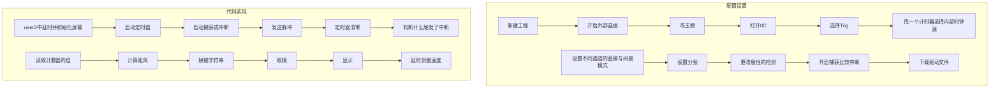

# STM32笔记

## 0. 电控通识
### 计算机
- 计算机是一种有通用计算能力的设备
- 存储器(内存),处理器,IO设备
### 抽象
- 其体现是接口(想想黑盒子),可以实现实现无关
#### 第一层抽象
- CPU是一个庞大的门电路,不同的CPU实现(微架构)不同,但都能够运行相同的程序
- 这得益于指令集架构(ISA),比如x86,ARM,龙芯,RISC-V
- 只要保证输入输出合适即可
- 时间片轮转调度用于控制各个程序的资源分配,操作系统用来调度和产生虚拟内存
#### 编译器
- 所有的指令都是一串01,汇编语言在不同的ISA中都不同
- 高级语言是对汇编语言的抽象
- 常用的编译器是用高级语言完成的,用更老版本的编译器编译,第一个编译器使用汇编语言
- 编译的步骤,看C++教材
#### 交叉编译
- STM32是ARM,使用x86编译,这就叫交叉编译
  
|build|Host|Target|
|-------|-------|-------|
|写代码和编译代码的操作平台|运行编译产物的平台|编译产物生成的代码所在的平台|
### 学会提问
### 工具链
GCC是GNU开发的编译器集合，支持包括C和C++在内的多种语言。其中C编译器是gcc，C++编译器是g++.
1. -o FILE：指定GCC的输出的目标文件名为FILE
2. -g：使GCC输出的目标包含调试信息
3. -O2 -O3 -Os：指定GCC的优化等级，一般使用最多使用O2即可，优化可能会影响调试。
4. -lLibrary：指定链接某个库（注意没有空格）
5. -IDirectory：指定搜索头文件的目录（注意没有空格）
6. -c：只编译，不链接
`g++ -o -g 文件名不带后缀 源代码名`是编译链接出exe
`./可执行文件名带后缀`是运行程序
## A. GPIO模式
- VDD 3.3V, VSS 0V
- 有保护
- HAL库实际就是更加方便的管理各种寄存器

### 输出模式
1. 推挽
- 只有输出3.3V或0
2. 开漏
- 只有输出断路和0V,可以控制高电流元器件工作
3. 复用推挽,复用开漏
- 他们用的是复用功能

### 输入模式

- 施密特触发器,是一种运放的使用方法,用于稳定电压
  
## B. 外部中断
`HAL_GPIO_TogglePin`用于翻转电平
`HAL_Delay`依赖于System ticktimer的中断
- 深入了解中断
- 中断向量:$\begin{cases}\text{EXTI 0~4有自己的IRQ函数}\\9~5公用,15~10公用\end{cases}$
- 需要清除请求挂起寄存器,防止中断的无限重复
- 中断优先级:$\begin{cases} 先比较抢占优先级,再比较响应优先级(同时发生)\\直接比较抢占优先级(中断打断了中断) \end{cases}$
- 中断优先级的数字越小,越优先

## C. UART
### 轮询模式
- CPU-->发送数据寄存器,发送移位寄存器
- CPU-->接受数据寄存器,接受移位寄存器
### 中断模式
- 发送数据寄存器,发送移位寄存器-->发送数据寄存器空中断
- 接受数据寄存器,接受移位寄存器-->接受数据寄存器非空中断
- 很多中断公用一个`IRQHandler`函数,所以使用各种不同的`CallBack`函数
### DMA模式
- DMA(直接内存访问)是一个用于搬运数据的"搬运工",搬运完成后叫回CPU
- DMA的发送只要写DMA就好
- DMA的不定长数据发送,使用串口空闲中断`ReceiveToIdle`,其回调函数是`HAL_UARTEx_RxEventCallBack`,但DMA的传输数据过半中断也会导致触发相同的回调,需要写`__HAL_DMA_DISABLE_IT(&usart2_rx,DMA_IT_HT)`来关闭
### 简单的数据包解析
- 数据包包括两帧的帧头,不定长数据,一帧的校验位,一般是先判断第一帧是不是约定好的数据
  
## D. IIC
- IIC是半双工,主从的,总线协议
- 代码是`HAL_Master_Receive()`和`HAL_Master_Transmit()`
- sprintf的用法是`sprintf(指针,"内容,包括%什么的",%的内容)`

## E. 时钟源和时钟树
- 时钟源能够消除光速和运算的时差问题
- AHB先进高性能总线,HCLK在总线中,然后有各种的枝叶
- 外设的总线有两个APB的时钟总线,链接各种外设 
- HCLK的源来自HSI高速内部时钟和HSE高速外部时钟或PLL锁相环

## F. 定时器
TIM 6 7 基本定时器
TIM 2~5 通用定时器
TIM 1 6 高级定时器
- 计数前计数器有一个预分频(prescaler (也是写m-1)),自动重装载寄存器定时m个脉冲,写m-1 
- 定时器的启动函数,`HAL_TIM_Base_Start(句柄)`放在init之后
- 定时器的获取计数值的方法`__HAL_TIM_GET_COUNTER(句柄)`返回值是一个数
- HAL_Delay(99)实际延时100ms
- 此外,还有获取/设置自动重装再寄存器,计数器,预分频器的相关函数
- 预分频器和自动重装载寄存器都有一个影子寄存器,下一轮之后才会生效,开关是auto-reload
- 定时器中断函数是`HAL_TIM_Base_Start_IT(句柄)`,回调是`HAL_TIM_PeriodElapsedCallBack(句柄)`
### 外部时钟
- GPIO的计数功能
- 有四个通道,TI1和TI2,输出TI1_ED,TI1FP1,TI2FP2,ED只能双边沿触发脉冲
- ETR外部触发器,有外部时钟模式2和1两种模式

- clock filter,clock polaerity,clock prescaler,依次是滤波(一般填15),极性,预分频
- 启动也是相同的,计数值也是相同的
- 从模式触发器也是自己在MX中更改
### 定时器从模式
#### 复位模式
- 不论自动重装载运行到哪里,都会立即复位,触发定时器更新中断
- 除了都会把更新中断标志位置1,复位模式还会把触发器中断标志位置1
- `__HAL_TIM_GET_FLAG(句柄,TIM_FLAG_TRIGGER)`是设置触发器中断标志位
- `__HAL_TIM_CLEAR_FLAG(句柄,TIM_FLAG_TRIGGER)`是清空触发器中断标志位
#### 门模式
- 门打开时,定时器正常计数,门关闭时,定时器暂停计数
#### 触发模式
- 从模式触发后,开始计数(默认是不会自动启动的)不能停止计数
- One Plus Mode单脉冲模式,自动重装载后,定时器停止计数,不在自动循环计数

- 在初始化后会立即触发一次定时器更新中断,如果不需要,可以`__HAL_TIM_CLEAR_FLAG(句柄,TIM_FLAG_UPDATE)`或者`__HAL_TIM_CLEAR_IT(句柄,TIM_FLAG_UPDATE)`
### 输入捕获
#### 超声波测距模块
- Trig 发送脉冲信号后开始测距
- Echo 一个脉冲持续的时间就是实际的时间
#### 方案
- 输入到上升沿或者下降沿,将计数器的值计数到捕获寄存器中,并触发输入捕获中断
- 能够避免软件的交互的时间误差
- 注意不能设置双边沿的捕获,所以有一个交叉的模式
- 自己用自己的是直接模式,否则是间接模式
- 开始的函数是`HAL_TIM_IC_Start(句柄,TIM_CHANNEL_X)`回调函数是`HAL_TIM_IC_CaptureCallBack()`,要写`htim->Channel == HAL_TIM_ACTIVE_CHANNEL_4`
- 读取的函数是`HAL_TIM_ReadCaptureValue(句柄,TIM_CHANNEL_3)`

## G. PWM